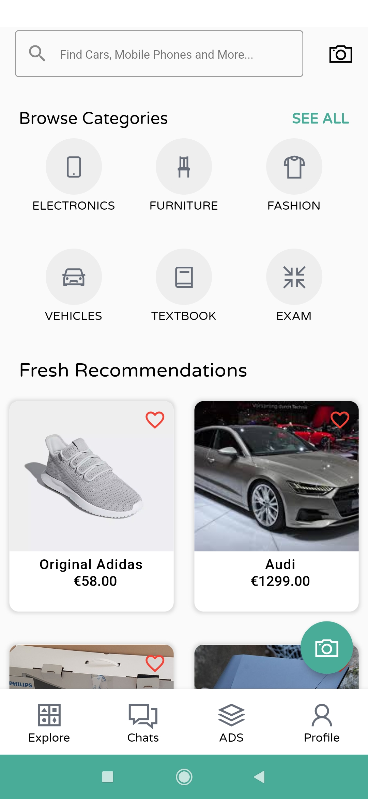
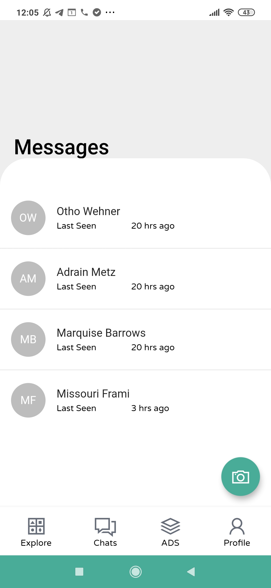
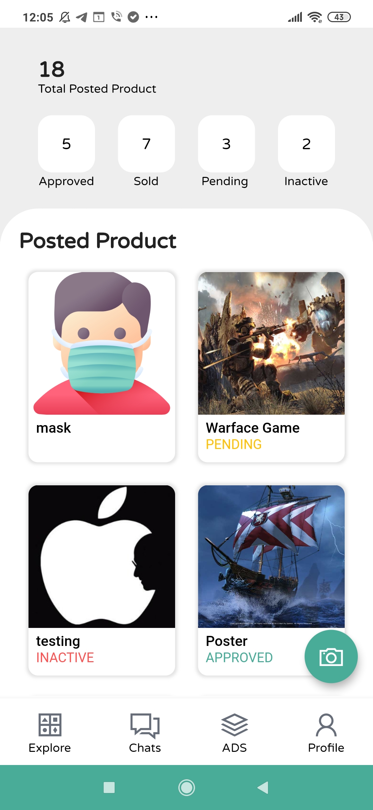

# SellIT Mobileapp (Educational Purpose)
 This mobile application is a personal project for a course I took during my Master's program. The mobile aplication is was built on the Flutter framework and the backend api was written in NodeJs.

##Excutive Summary of the Application
[Document](https://docs.google.com/document/d/11pKeHCEFNEo_TIwEz3EjIrHNZ2mUv9N7jiiGhmZo47s/edit?usp=sharing)

Some of the design used in this application was modelled from Olx and N26 mobile application. 

# Some UI Screens of the Application (Educational Purpose)
  

